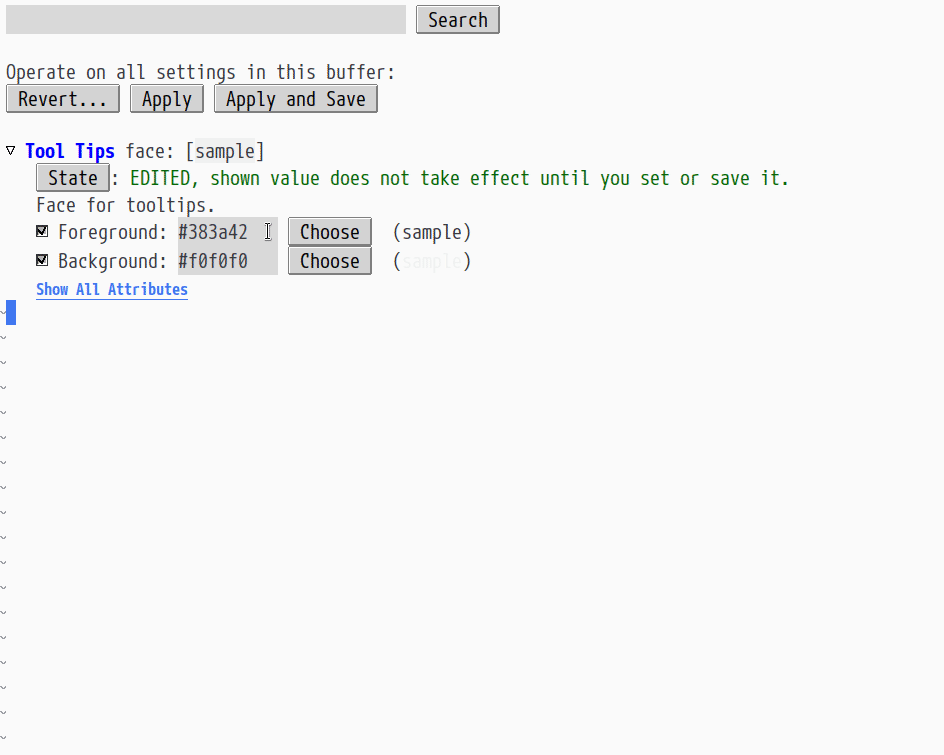

# webkit-color-picker

Small experiment with embedded a Webkit widgets in a childframe. Requires Emacs 26 compiled with [embedded Webkit Widget support](https://www.gnu.org/software/emacs/manual/html_node/emacs/Embedded-WebKit-Widgets.html).

    (require 'webkit-color-picker)
    (global-set-key (kbd "C-c C-p") 'webkit-color-picker-show)

## Screenshot

